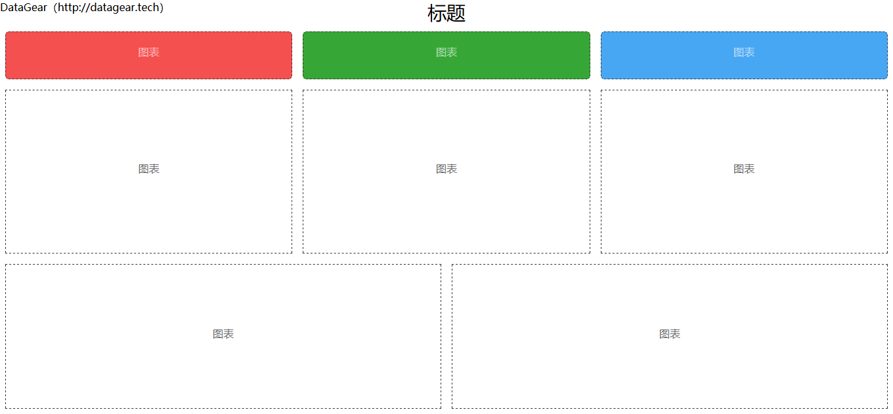
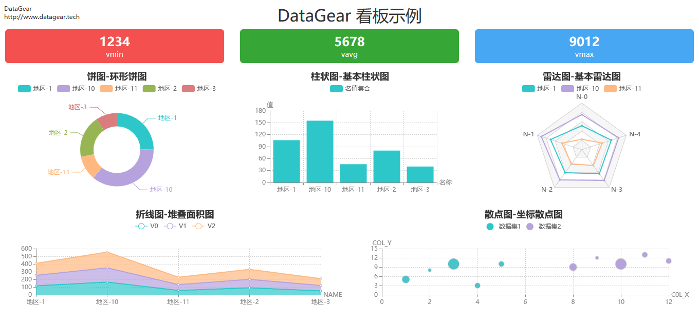
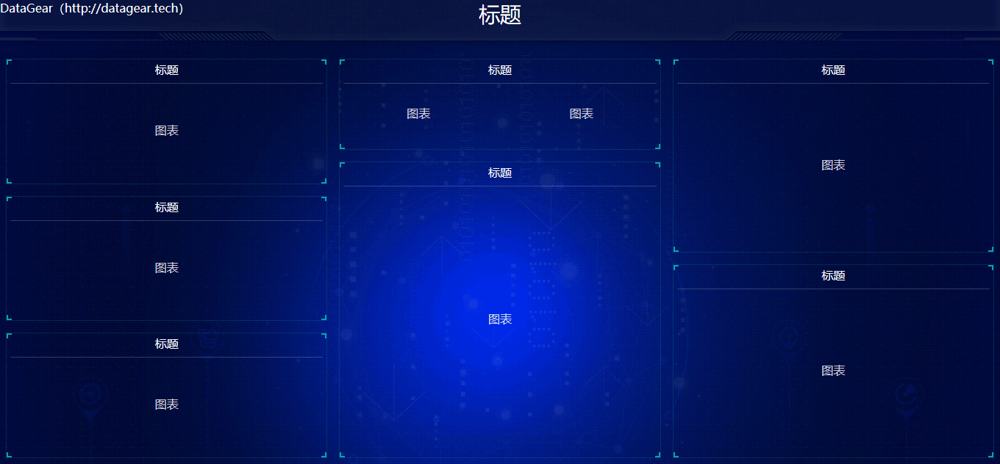
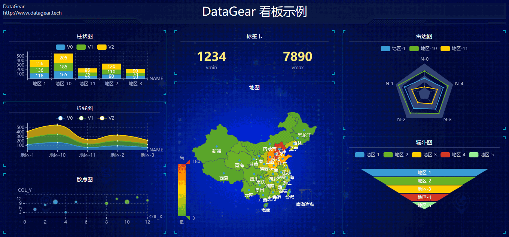

# DataGear看板模板

此项目包含静态HTML模板，可作为看板模板导入至[DataGear](http://www.datagear.tech)数据可视化分析平台，制作数据可视化看板。

持续更新中...

# 导入模板步骤

1. 进入此项目其中一个模板目录，比如`template-001`

2. 将目录内的所有文件打包成`ZIP`压缩包（注意：所有文件都应直接在压缩包根目录内，不要多嵌套一层）

3. 在[DataGear](http://www.datagear.tech)的看板管理页面，点击【导入】按钮，导入上述压缩包即可

# DataGear

[DataGear](http://www.datagear.tech)是一款数据可视化分析平台，使用Java语言开发，采用浏览器/服务器架构，支持SQL、CSV、Excel、HTTP接口、JSON等多种数据源，
主要功能包括数据管理、SQL工作台、数据导入/导出、数据集管理、图表管理、看板管理等。

官网地址：[http://www.datagear.tech](http://www.datagear.tech)

项目地址：[https://gitee.com/datagear/datagear](https://gitee.com/datagear/datagear)

# 模板截图

template-001

template-002

